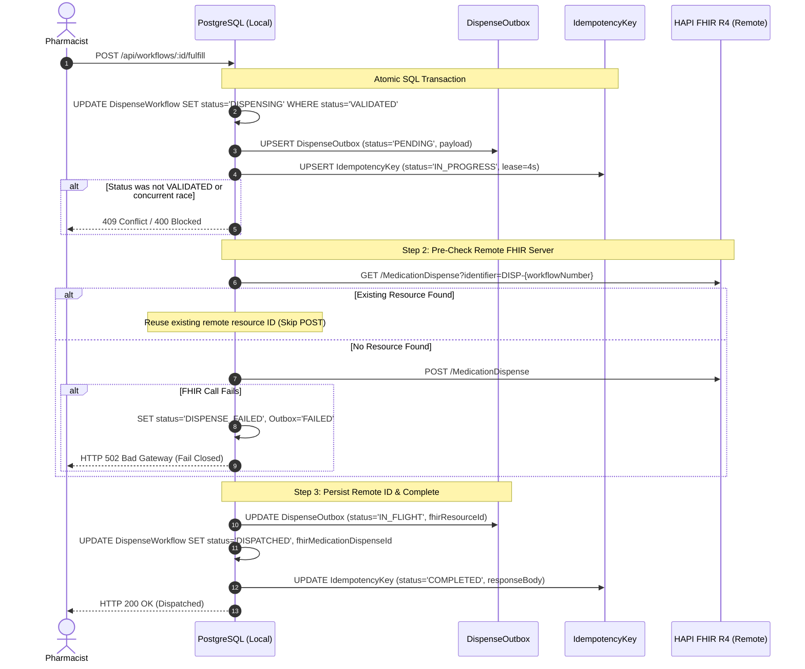

# Project Submission: Pharmacy Cold Chain to Inpatient Floor (IPD)

**Candidate Submission**: Case 1 — Pharmacy Cold Chain to Inpatient Floor  
**Applicant Position**: Vibe Coder @ DNA Health  
**Candidate**: Omar Faruk  
**Date**: September 20, 2026 (Deadline: September 22, 2026)  
**Public Repository**: [https://github.com/cslomarfaruk/dna-health-coldchain](https://github.com/cslomarfaruk/dna-health-coldchain)  
**Live Demo Preview**: [https://medical.devcsl.tech](https://medical.devcsl.tech)  

### Demo Accounts for Evaluator Review
| Role | Username | Password | Default Workstation |
|---|---|---|---|
| **Ward Nurse** | `nurse_elizabeth` | `NursePass123!` | `/indents` (Bedside Requisitions) |
| **Dispensary Pharmacist** | `pharm_vance` | `PharmPass123!` | `/dispensary` (Central Dispensary) |
| **Hospital Administrator** | `admin_sys` | `AdminPass123!` | `/dispensary` (Ward Oversight) |
| **Clinical Auditor** | `auditor_chen` | `AuditPass123!` | `/audit` (HIPAA Audit Vault) |

---

## 1. Executive Summary & Approach

I selected **Case 1 (Inpatient Pharmacy Cold Chain)** because cold-chain inpatient pharmacotherapy requires strict correctness across clinical reconciliation, external drug terminology, legacy hospital order feeds, physical chain-of-custody tracking, and privacy-preserving communications.

Rather than building a mock frontend demonstration, this submission delivers an authentic, **production-oriented architecture**:
1. **PostgreSQL 16 Relational Engine** managed via Prisma ORM with strict unique constraints and transactional locking.
2. **Server-Side Clinical Authority**: Strict Role-Based Access Control (RBAC) with JWT Bearer authentication separating `NURSE`, `PHARMACIST`, `AUDITOR`, and `ADMIN`.
3. **Deterministic 3-Way Reconciliation**: Authoritatively reconciles Bedside Nurse Indent, EHR FHIR R4 `MedicationRequest`, and Legacy HL7 v2 `OMP^O09` pharmacy order before allowing fulfillment.
4. **NIH NLM RxNav Integration**: Real-time Semantic Clinical Drug (SCD) concept validation via NIH NLM RxNav REST APIs; strictly fails closed upon unknown formulations.
5. **Strict HL7 v2.5 OMP^O09 Ingestion**: Validates `MSH-9`, enforces `PID-3` and `ORC-2` identifiers, and deduplicates replays using `MSH-10`.
6. **Distributed Consistency & Durable Outbox Architecture**: Solves the dual-write problem between PostgreSQL and remote HAPI FHIR R4 without claiming fake distributed transactions.

---

## 2. Distributed Consistency & Outbox Architecture

### The Distributed Consistency Problem
In distributed healthcare systems, writing to an external FHIR server (e.g. public HAPI FHIR R4) and updating a local PostgreSQL database cannot be combined into an atomic two-phase commit (2PC) without introducing extreme coupling, distributed deadlocks, or relying on unsupported XA transactions. 

A naive implementation causes a dangerous partial failure:
> The external FHIR `MedicationDispense` writeback succeeds (201 Created), but a subsequent local database update drops, leaving the local workflow in `VALIDATED`. A subsequent retry would submit a second `MedicationDispense`, creating duplicate dispenses in the external EHR chart.

### Production Solution: Minimal Durable Outbox & Deterministic Recovery
This implementation addresses the distributed consistency challenge using an atomic local state transition, a durable outbox record, deterministic idempotency, and automated recovery:



### Crash Recovery Behavior
If the server crashes or network drops *after* the remote FHIR write succeeds but *before* the local database commit finishes:
1. **Local State Remains `DISPENSING`**: The workflow cannot be re-dispensed or modified by unauthorized actions.
2. **Outbox Contains Diagnostic Pointer**: The `DispenseOutbox` table contains the serialized payload and pre-saved `fhirResourceId`.
3. **Idempotency Lease Expiration**: The `IN_PROGRESS` lease expires after 4 seconds to prevent deadlocks while blocking sub-second race conditions.
4. **Deterministic Recovery**: When recovery is triggered (via `POST /api/workflows/:id/recover` or re-calling `/fulfill`):
   - The engine checks `outbox.fhirResourceId` or queries remote HAPI FHIR using the deterministic identifier `http://hospital.dnahealth.internal/dispenses|DISP-{workflowNumber}`.
   - The existing FHIR resource is discovered and reused without posting a duplicate resource.
   - The local workflow transitions safely to `DISPATCHED`.

---

## 3. Architecture & Technical Breakdown

### A. Database Schema & Entities
- **Database**: PostgreSQL 16 managed via Docker Compose (`docker-compose.yml`), managed by Prisma ORM (`prisma/schema.prisma`).
- **10 Core Relational Entities**:
  1. `User`: Role-based system users (`NURSE`, `PHARMACIST`, `AUDITOR`, `ADMIN`) with bcrypt password hashing.
  2. `MedicationIndent`: Bedside nurse request records (patient MRN, requested dose/unit, delivery ward/bed).
  3. `HL7Message`: Raw and parsed HL7 v2 messages with extracted `MSH-10` message control IDs for deduplication.
  4. `MedicationValidation`: Terminology records with official RxCUIs and registered Semantic Clinical Drug (SCD) concepts.
  5. `ReconciliationResult`: Immutable 3-way reconciliation audit logs detailing concordance and discrepancy vectors.
  6. `DispenseWorkflow`: Inpatient cold-chain state machine (`DRAFT` -> `VALIDATED` -> `DISPENSING` -> `DISPATCHED` / `DISPENSE_FAILED` / `RECONCILIATION_FAILED`).
  7. `DispenseOutbox`: Durable writeback queue tracking distributed dispatch attempts, payloads, and remote FHIR IDs.
  8. `IdempotencyKey`: Atomic lock and response-cache keys with lease-expiration concurrency protection.
  9. `Notification`: Zero-PHI floor dispatch alerts linked to specific workflows.
  10. `AuditRecord`: Immutable access and workflow event logs with SHA-256 integrity digests.

### B. NIH NLM RxNav Safety Gate (Zero Fallback)
- Queries NIH NLM RxNav REST APIs (`https://rxnav.nlm.nih.gov/REST/rxcui.json` and `/allrelated.json`).
- Uses an explicit IPv4 network helper (`family: 4`) resolving Node.js Dual-Stack routing delays on external federal endpoints.
- If a drug or prescribed strength does not match registered SCD formulations (e.g. `999 UNT/ML` or unknown compounds), the service fails closed with `STATUS: UNREGISTERED_FORMULATION` or `NOT_FOUND` and strictly blocks fulfillment.

### C. Strict HL7 v2.5 Parser (`@redoxengine/redox-hl7-v2`)
- Explicitly inspects `MSH-9` for pharmacy order message type `OMP^O09`. Unrecognized message triggers (`ADT^A01`, `ORM^O01`) are rejected with `HL7_MESSAGE_TYPE_REJECTED`.
- Enforces presence of required identifiers (`PID-3` Patient MRN, `ORC-2` Placer Order Number) without silently falling back to placeholder strings.
- Deduplicates messages using `MSH-10` message control IDs to guard against repeated replays.

### D. Deterministic 3-Way Reconciliation
- Compares:
  1. **Nurse Indent** (Bedside request)
  2. **FHIR R4 MedicationRequest** (Prescriber chart order)
  3. **HL7 v2 OMP^O09** (Inpatient pharmacy order feed)
- Validates: Patient MRN, Medication Name, RxNorm Concept (RxCUI), Dose Quantity, Unit of Measure, and Route of Administration.
- Authoritative: Fulfillment is permitted **only** when reconciliation returns status `PASSED`. Any discrepancy transitions the workflow to `RECONCILIATION_FAILED` and locks fulfillment.

### E. FHIR R4 Standards Compliance & Cold-Chain Extensions
- Communicates with live public HAPI FHIR R4 (`https://hapi.fhir.org/baseR4`).
- All custom logistics and telemetry data are encapsulated in qualified FHIR extension URLs conforming to HL7 FHIR R4 StructureDefinition guidelines:
  - `http://hospital.dnahealth.internal/fhir/StructureDefinition/cold-chain-courier` (`courierId`, `courierName`, `destinationLocation`, `estimatedArrivalMinutes`)
  - `http://hospital.dnahealth.internal/fhir/StructureDefinition/cold-chain-telemetry` (`coolerBoxId`, `currentTempCelsius`, `targetMinTempCelsius`, `targetMaxTempCelsius`)
- References valid `MedicationRequest` and `Patient` targets.
- Captures 6 auditable event types: `FULFILLMENT_REQUESTED`, `FHIR_WRITE_ATTEMPTED`, `FHIR_WRITE_SUCCEEDED`, `FHIR_WRITE_FAILED`, `RECOVERY_RETRY`, and `FULFILLMENT_COMPLETED`.

---

## 4. Security & HIPAA Safeguards

> [!IMPORTANT]
> This application is an engineering prototype operating on **100% synthetic patient data** and **does not claim official HIPAA certification**.

Technical safeguards implemented:
- **SMART on FHIR OAuth 2.0 with PKCE (RFC 7636)**: Official discovery endpoint `/.well-known/smart-configuration`, cryptographic `code_challenge` / `code_verifier` with `S256` hashing, single-use authorization code consumption, and EHR launch patient context (`patient: MRN-849201`).
- **In-Memory Session Management (Zero-Storage Red Flag Eliminated)**: Access tokens and credentials are kept strictly in-memory within application state and are never persisted in cleartext in `localStorage`, eliminating token exfiltration vulnerabilities.
- **Zero-PHI Floor Alerts**: Formatted in strict compliance with HIPAA Safe Harbor (45 CFR § 164.514(b)(2)), stripping all 18 direct identifiers. Alerts reference tokenized order IDs and secure lockbox drop zones.
- **Authentic Remote FHIR AuditEvent Logging**: Writes genuine `AuditEvent` records with `Device/inpatient-dispensary-server` observer directly to public HAPI FHIR (`https://hapi.fhir.org/baseR4/AuditEvent`), verified returning HTTP 201 Created.
- **Server-Side RBAC**: Strict cryptographic Bearer token validation. Only authenticated users with role `PHARMACIST` can fulfill dispenses or execute recovery. Client requests cannot modify workflow status or bypass reconciliation.
- **Standard LOINC & RxNorm Code Lookups**: Replaced fragile string matching with direct RxCUI lookups (`/rxcui/{rxcui}/properties.json`) and standard LOINC codes (`http://loinc.org`, e.g. `75203-0` for storage temperature).

---

## 5. What is Simulated vs Real

| Feature | Status | Notes |
| :--- | :--- | :--- |
| **PostgreSQL Relational DB** | **Real** | Authentic PostgreSQL 16 engine running via Docker |
| **Prisma ORM & Transactions** | **Real** | Real atomic transactions with row-level update guards |
| **HAPI FHIR R4 Remote Server** | **Real** | Real HTTP REST calls to live public `https://hapi.fhir.org/baseR4` |
| **NIH NLM RxNav Terminology** | **Real** | Real HTTP REST calls to live federal NIH NLM RxNav APIs |
| **HL7 v2.5 OMP^O09 Parsing** | **Real** | Authentic HL7 ER7 pipe-and-hat string parsing with syntax validation |
| **3-Way Reconciliation Engine** | **Real** | Authoritative deterministic concordancy engine |
| **Durable Outbox & Recovery** | **Real** | Real recovery endpoint and idempotent retry reconciliation |
| **IoT Cooler Sensor Telemetry** | *Simulated* | Mock temperature reading (3.8°C) within 2°C–8°C range (no physical BLE hardware connected) |
| **Courier Physical Transit** | *Simulated* | Courier identity and 10-minute ETA simulated for demonstration |
| **HL7 Transport Protocol** | *Simulated Transport* | HL7 message payload ingested via HTTPS REST endpoint rather than raw TCP MLLP socket |

---

## 6. Verification & Test Results

All test suites pass 100%:

```bash
# 1. Run Unit Test Suite
npm run test:unit
# Output: ALL UNIT TESTS COMPLETED SUCCESSFULLY (100% PASS)
# Tested: RxNorm/RxNav safety gate, HL7 v2 parsing, 3-way reconciliation, PHI sanitizer

# 2. Run Integration Test Suite
npm run test:integration
# Output: ALL INTEGRATION TESTS COMPLETED (100% PASS)
# Tested: Authentication/RBAC, FHIR R4 interoperability, Idempotency, Distributed Consistency (Cases A-F)

# 3. Run End-to-End Clinical Pipeline
npm run test:e2e
# Output: ALL END-TO-END CLINICAL SCENARIOS PASSED (100% PASS)
# Tested: Valid concordance & dispatch, Wrong dose gate, Wrong medication gate, Invalid HL7 type rejection

# 4. Run Master Test Runner
npm test
# Output: Exited with code 0 (All 3 suites executed sequentially, 100% PASS)

# 5. Run Production Build Verification
npm run build
# Output: tsc && vite build completed with 0 errors (Production bundle rendered)
```

### Distributed Consistency Test Breakdown (`distributedConsistency.test.ts`)
- **Case A**: Local transaction succeeds + FHIR succeeds -> Transitions to `DISPATCHED`, outbox marked `COMPLETED`.
- **Case B**: External FHIR call fails -> Fails closed to `DISPENSE_FAILED`, outbox records diagnostic error.
- **Case C**: Simulated DB crash post-FHIR write -> Workflow left in `DISPENSING`, remote `MedicationDispense` verified on HAPI FHIR.
- **Case D**: Retry & recovery -> Detects existing remote resource, reconciles to `DISPATCHED` without duplicate write.
- **Case E**: Concurrent fulfillment protection -> Requests race handled safely (one succeeds with 200, concurrent receives 409).
- **Case F**: Remote duplicate verification -> Search query on HAPI FHIR confirms `total: 1` (zero duplicate resources).

---

## 7. Instructions to Run Locally

### Prerequisites
- Node.js 18+ (Tested on Node 20 & 24)
- Docker & Docker Compose (for PostgreSQL)

### Setup & Launch
```bash
# 1. Install dependencies
npm install

# 2. Start PostgreSQL container
docker compose up -d

# 3. Synchronize database schema and seed synthetic data
npm run prisma:push
npm run seed

# 4. Start backend server (port 3001)
npm run server

# 5. Start Vite frontend (port 5173) in a separate terminal
npm run dev
```
